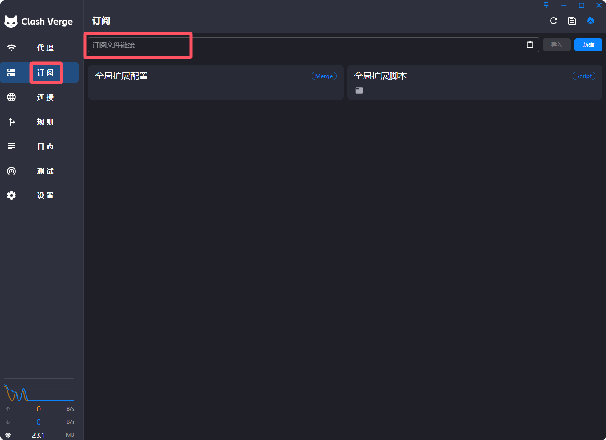
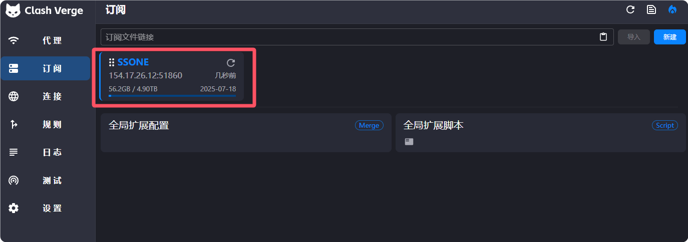
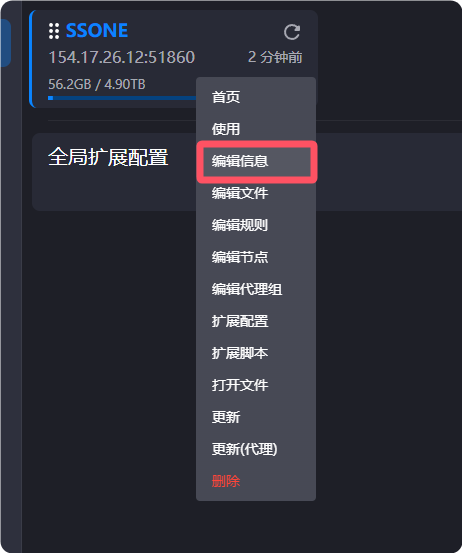
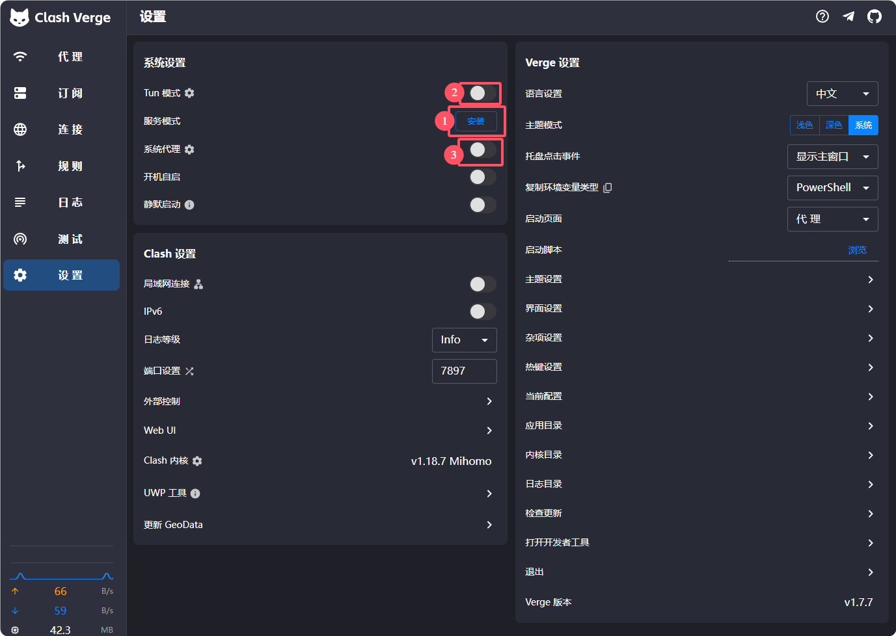
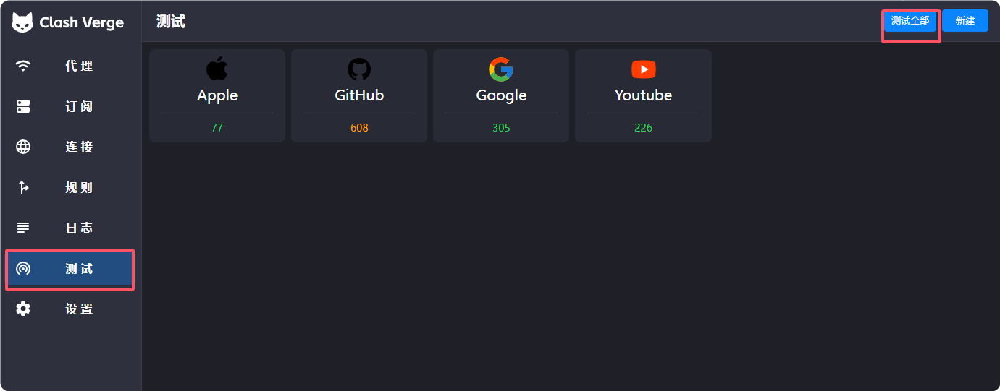

手把手教学安装clash，简单易用，适合新手。

<!-- more -->

## 下载安装

::: tabs

@tab clash-verge 下载 (推荐)

该客户端已汉化，并且包含了 linux、mac、windows 三个版本。

[https://github.com/clash-verge-rev/clash-verge-rev/releases](https://github.com/clash-verge-rev/clash-verge-rev/releases)

@tab github 汉化版下载

[https://github.com/Z-Siqi/Clash-for-Windows_Chinese/releases/](https://github.com/Z-Siqi/Clash-for-Windows_Chinese/releases/)

:::

下载后直接安装即可，推荐下载 clash-verge

## 配置

点击`订阅`，把你的订阅链接粘贴到输入框中，点击`导入`。

如果没有订阅链接可以参考这篇文章：[便宜好用的翻墙机场推荐评测](https://tg-nav.github.io/nodeshare/)

导入成功后就会出现该订阅

该订阅默认是 1440分钟（24小时）更新一次，可以根据自己的需求调整。

右键点击`编辑配置`即可调整更新时间、订阅链接、名称等信息。

在`设置`中点击`服务模式`右侧的安装，安装成功后点击`启动`，然后打开`Tun 模式`开关与`系统代理`开关。

最后检查一下`代理`中的模式是否为`规则`

## 测试

点击`测试`中的`测试全部`，如果没啥问题就大功告成了！
